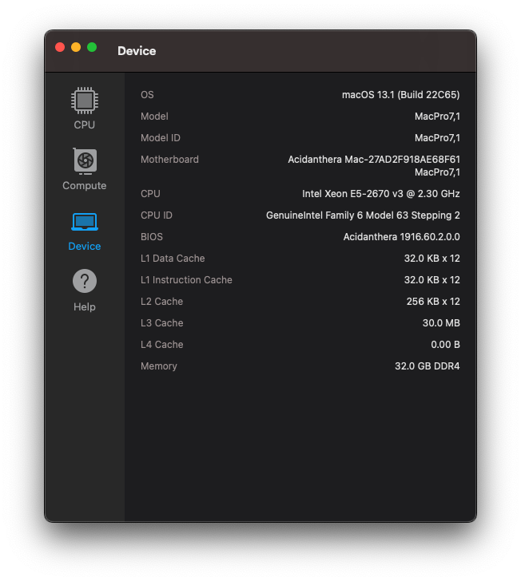

# HUANANZHI X99 BD4 + Intel® Xeon® E5-2670 v3 + AMD Radeon™ RX 6600 + Fenvi T919

**Latest working macOS**: 13.1
 
**Current OpenCore**: 0.8.8

---

## Complete hardware specs
- Intel® Xeon® E5-2670 v3 (All cores activated)
- HUANANZHI X99 BD4 + Unlock Turbo Boost + Resizable Bar Activated
- AMD Radeon™ RX 6600
- 2x 16Gb DDR4 3200Mhz ECC Atermiter
- Wifi/BT replaced by Fenvi T919

## What works
- macOS Ventura, Big Sur, Catalina and macOS Monterey
- Audio
- HDMI/DP (in dGPU - Works OOB)
- All USB ports
- Everything iCloud related (Drive, iMessage, Facetime, unlock with Apple Watch, etc)
- Temperature monitoring for everything except GPU
- DRM content (Netflix, ATV+, Airplay 2 mirroring etc)
- Shutdown/Reboot/Update to newer macOS builds over time
- Resizable Bar ON (ResizeAppleGpuBars = 8)

## What doesn't work
- Sleep? Never got the chance to test it, my hackintosh is up 24/7

## Kexts used:
- [x] AppleALC.kext
- [x] CpuTscSync.kext
- [x] Lilu.kext
- [ ] NVMeFix.kext (disabled)
- [x] RealtekRTL8111.kext
- [x] RestrictEvents.kext
- [x] SMCSuperIO.kext
- [x] SMCProcessor.kext
- [x] USBMap.kext
- [x] VirtualSMC.kext
- [x] WhateverGreen.kext
- [x] XHCI-unsupported.kext

## Geekbench Results:

---

---

## Thanks/Credits
- [Opencore Team](https://dortania.github.io/getting-started/)
- [BASE-EFI-INTEL-HEDT-4THGEN-X99-HASWELL-E](https://github.com/luchina-gabriel/BASE-EFI-INTEL-HEDT-4THGEN-X99-HASWELL-E)
- [Gabriel Luchina](https://github.com/luchina-gabriel)

## Discord - Universo Hackintosh
- [Access Discord](https://discord.universohackintosh.com.br)

